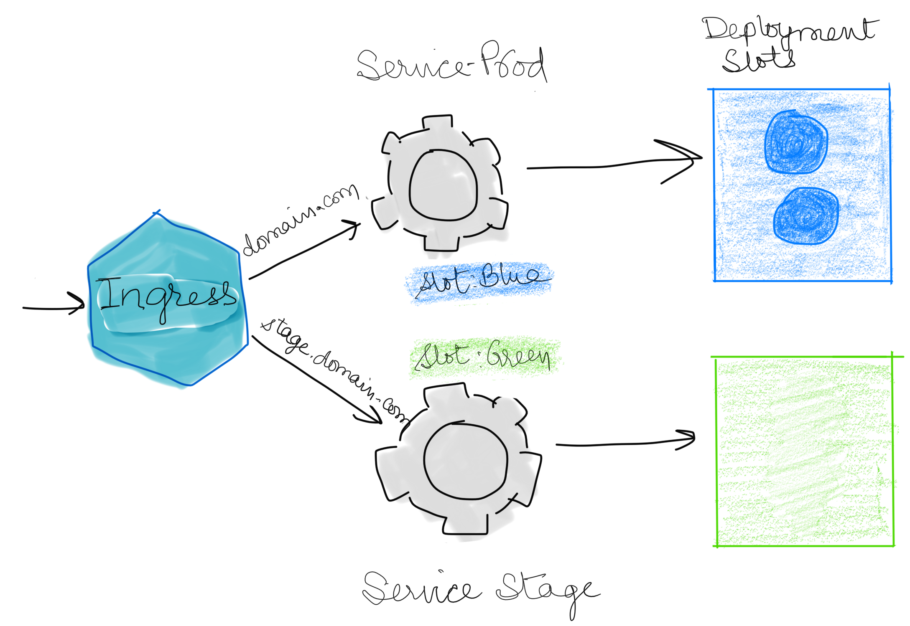
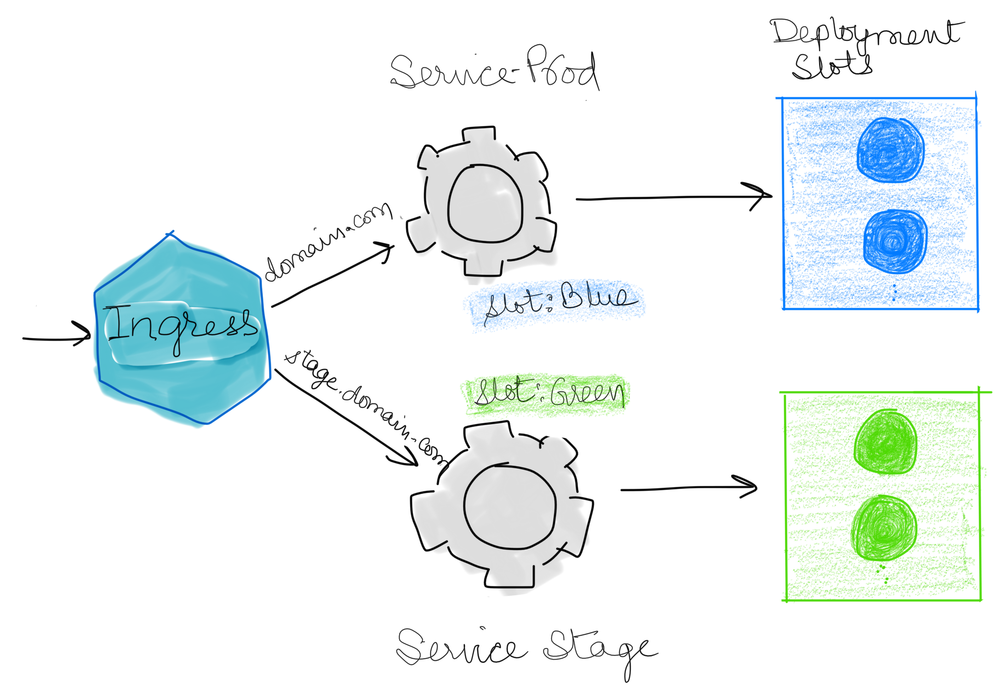
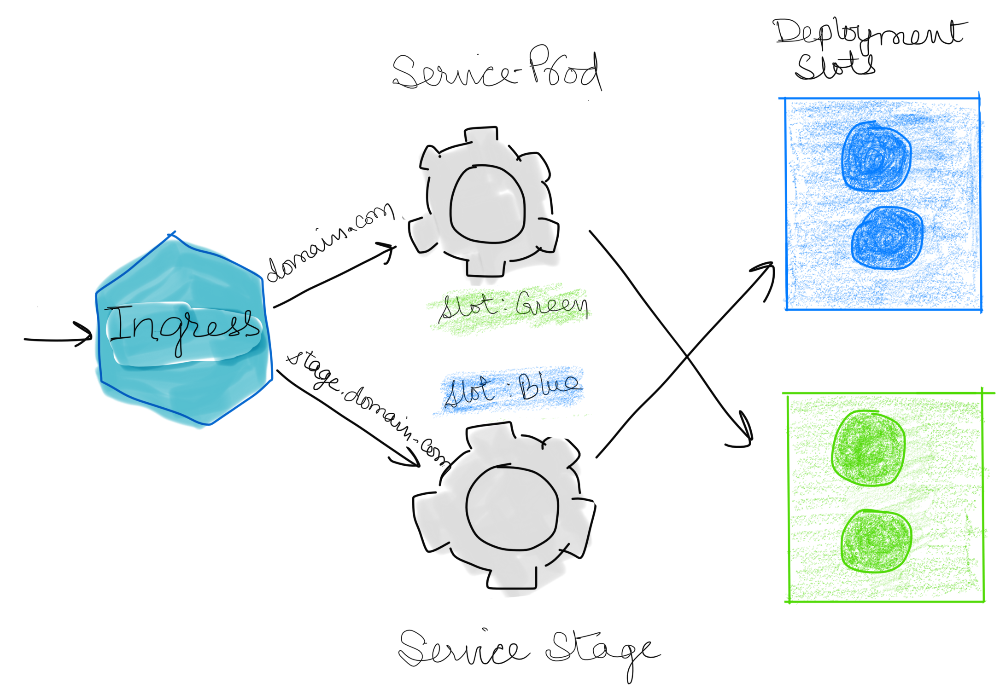
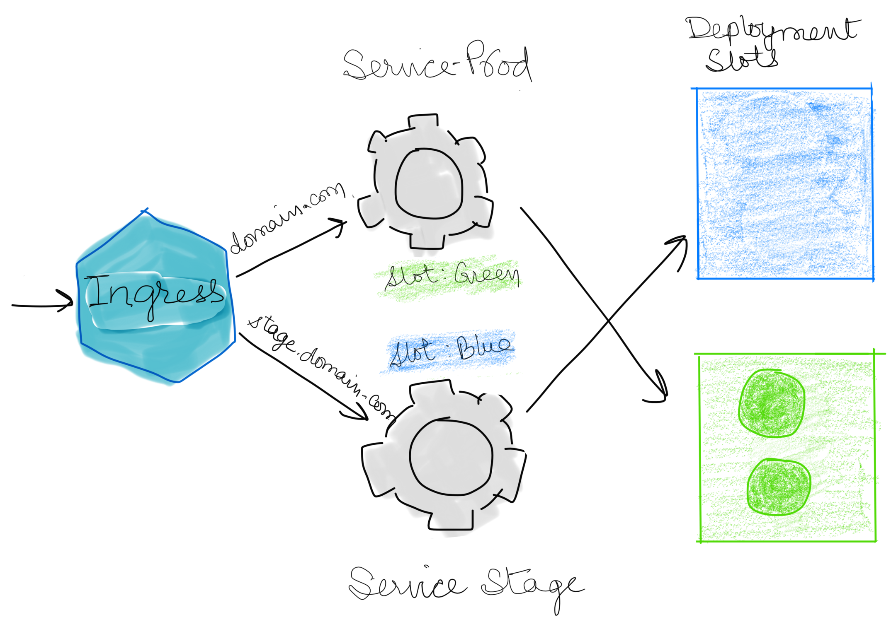

This chart is to demonstrate use of Blue/Green deployment strategy.
It uses following primary resources:
1. service-prod: Serves the production traffic.
2. service-stage: Uased for test traffic.
3. Ingress: NGINX ingress controller - Based on HostName routes production traffic to service-prod, and test traffic to service-stage.
4. service-lb: loadbalances traffic from outside to Ingress.
5. Deployments [Simple NGINX Server]
    5.1 deployment-blue: 
    5.2 deployment-green:
    Both deployment yamls are identical : except for they target different slots[i.e. blue or green. Slot is virtual concept realized by attaching label slot=blue|green to the pods, Service routed traffic to pods based on the slot value]. Which one to deploy is controlled by variables blue.enabled & green.enabled.

A key variable is productionSlot. Based on its value prod service is configured to route the traffic to that slot.
Following image is for the case when `productionSlot: blue`

To Deploy the new release in green slot do following:
`helm upgrade releasename repo/blue-green --set green.enabled=true --reuse-values`

After that following would be the state.[Green circles represent the pods created in green slot]:

When testing is completed, and you are ready to promote this release to get Production traffic, run following command:
`helm upgrade releasename repo/blue-green --set productionSlot=green --reuse-values`

After this, state will be as follows:

If later, you want to delete the pods in blue slot [Optional], do following:
`helm upgrade releasename repo/blue-green --set blue.enabled=false --reuse-values`
Following will the state after it:

Hope its useful. Happy Helming!!